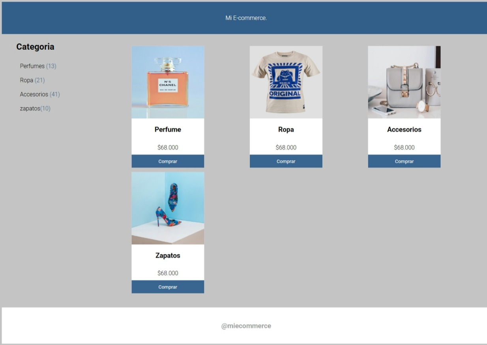

# css-grid-desafio

## 📌 Requerimientos cumplidos
✅ Crear un layout con CSS Grid y grid-template-areas
Se utilizó grid-template-areas para definir claramente las zonas: header, menu, main, y footer.

✅ Crear una grilla de productos con CSS Grid
Se utilizó Grid en la sección principal (main) para distribuir los productos en una cuadrícula de 3 columnas.

✅ Utilizar Flexbox para la barra lateral
La sección de categorías fue alineada con Flexbox para lograr una distribución limpia y legible.

✅ Utilizar Flexbox en las tarjetas de productos
Cada tarjeta de producto utiliza Flexbox con flex-direction: column para alinear el contenido verticalmente.

## 🧰 Tecnologías utilizadas
HTML5

CSS3

CSS Grid

Flexbox

Google Fonts (Roboto)

## 🎨 Personalización
Tema: Tienda Online

Paleta de colores propia

Imágenes personalizadas (perfume, ropa, accesorios, zapatos)

Tipografía personalizada desde Google Fonts

## 🚀 Cómo ver el proyecto

1. Clona este repositorio:
```bash
git clone https://github.com/Andreadavj/css-grid.git

📸 Vista previa del proyecto



🧠 Aprendizajes y reflexión
Este proyecto me permitió fortalecer mi comprensión del sistema de CSS Grid, organizar el layout de forma semántica, y reforzar el uso de Flexbox para distribuir elementos en componentes más pequeños. Entendí cómo estructurar páginas responsivas, reutilizables y fáciles de mantener.

✨ Autora
Doris Valverde Jara
Frontend Developer | GitHub | LinkedIn
